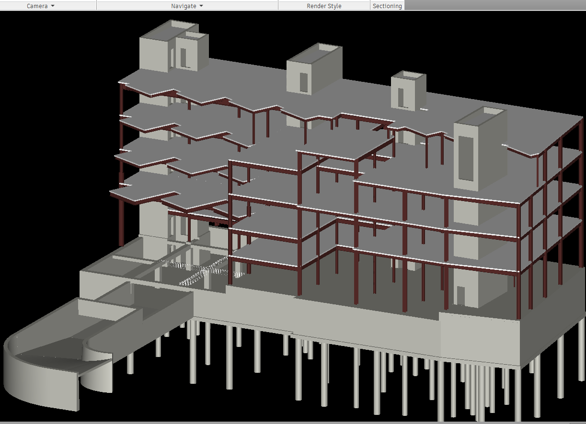

# Structural Element Analysis from IFC Data

This project explores structural elements extracted from IFC (Industry Foundation Classes) files, focusing on identifying, categorizing, and visualizing key object types such as **rebar bars, columns, beams, slabs, and floors**. It aims to surface structured insights from model data typically buried in geometric and technical metadata.

## Overview

Building Information Modeling (BIM) platforms store complex data in IFC files, much of which is challenging to analyze directly. This project breaks down and simplifies that data to help answer questions like:

- What structural elements are present in a model?
- How frequently do specific object types (e.g., Rebar Bar, Structural Column) appear?
- How can this information be visualized and used for further analysis?

## Data Source

The structural data used in this project was extracted from the **Snowdon Tower Sample Project**, provided by Autodesk as a demonstration model.

- **Software Used**: Revit 2024  
- **Export Format**: IFC  
- **Source**: [Autodesk Sample Project – Snowdon Tower](https://help.autodesk.com/view/RVT/2024/ENU/?guid=GUID-61EF2F22-3A1F-4317-B925-1E85F138BE88)

## Objectives

- **Extract Meaningful Data**: Go beyond geometric information to access structured data relevant to construction elements.
- **Visualize Distributions**: Create clear visualizations that show how often key elements appear in a model.
- **Lay the Groundwork**: Enable deeper, data-driven exploration for BIM and construction-related applications.

## Targeted Object Types

The analysis focuses on commonly used structural components, including:

- **Rebar Bars**  
- **Structural Columns**  
- **Beams**  
- **Slabs / Floors**  

## Visuals

The `Visuals/` folder contains output charts that summarize the distribution and quality of structural elements from the IFC model.

### Distribution of Beam Types
Shows the count of various beam object types found in the structural model.

### Distribution of Column Types
Visualizes how different types of structural columns are represented in the model.

### Distribution of Null Counts Across Column Types
Highlights which column types contain missing or null data, useful for data quality checks.

### Distribution of Rebar Types
Displays the frequency of different rebar bar types used throughout the model.

These elements are filtered based on their `ObjectType` within the model data and counted for visualization and interpretation.

## Tools Used

- **Pandas** – For cleaning and filtering model data
- **Matplotlib** – For plotting bar charts of element types
- **ifcopenshell** – For parsing IFC files directly

## Workflow

1. **Load Data**  
   Structural data exported or parsed from IFC models is loaded into a DataFrame.

2. **Filter by Object Type**  
   The dataset is filtered to focus on specific structural elements (columns, beams, slabs, rebars).

3. **Aggregate & Count**  
   The frequency of each object type is counted using `value_counts`.

4. **Visualize**  
   Bar charts are generated to show the distribution, with each bar labeled for readability.

---

## Why This Matters

Understanding the composition of a structural model can help in:

- Quality control and design audits  
- Quantity takeoff and estimation  
- Model validation and automation workflows  
- Training datasets for BIM-related AI tools

## Future Work

- Automate data extraction directly from `.ifc` files using `ifcopenshell`
- Add support for mapping objects to materials or properties
- Expand visualization options to include time-series (for staged construction), floor-level summaries, or structural load tagging

